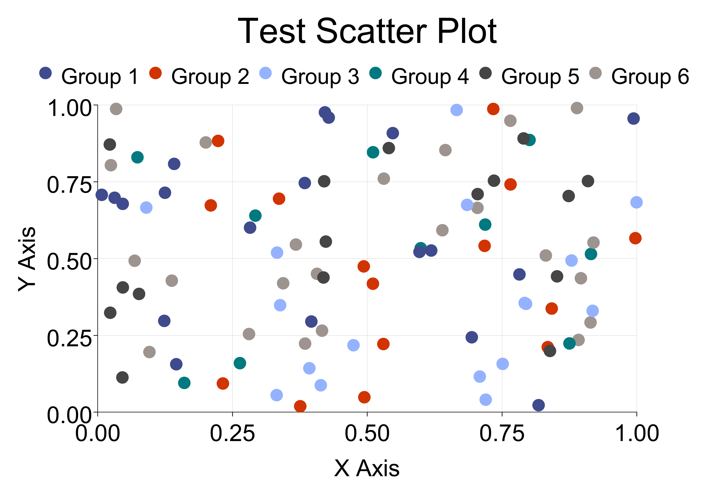

# Storch Plot: A Scala 3 Plotting Library

Storch Plot is a powerful plotting library written in Scala 3, designed to be a worthy competitor to Python's Matplotlib. It offers a wide range of visualization options and serves as an invaluable tool for data exploration, model evaluation, and tuning in Storch model training. This library provides an excellent experience for future Storch training tasks.

## Features
- **Scala 3 Native**: Built with the latest Scala 3 features, ensuring type safety and modern programming paradigms.
- **Versatile Visualizations**: Supports multiple display formats, including scatter plots, line plots, bar charts, and more.
- **Storch Integration**: Seamlessly integrates with Storch for model training data analysis.

```scala 3
sbt compile

libraryDependencies += "io.github.mullerhai" % "storch-plot_3" % "0.0.2"

```
## Visual Examples
Here are some examples of the visualizations generated by Storch Plot:



[//]: # (![Example 2]&#40;path/to/your/second_image.png&#41;)

[//]: # (![Example 3]&#40;path/to/your/third_image.png&#41;)

## Code Demos

### Demo 1: Basic Scatter Plot
```scala 3
import torch.evilplot._
import torch.evilplot.plot._
import torch.evilplot.plot.aesthetics.DefaultTheme._
import torch.evilplot.numeric.Point
import scala.swing._
import scala.swing.event._
import java.awt.{Graphics2D, Color, geom}

object EvilPlot {
  val data = Seq.tabulate(100) { i =>
    Point(i.toDouble, scala.util.Random.nextDouble())
  }
  val bf = ScatterPlot(data).render().asBufferedImage
}

object SwingApp extends SimpleSwingApplication {
  lazy val ui: Panel = new Panel {
    background = Color.white
    preferredSize = new Dimension(1000, 1000)
    focusable = true

    override def paintComponent(g: Graphics2D): Unit = {
      super.paintComponent(g)
      g.drawImage(EvilPlot.bf, null, 0, 0)
    }
  }

  def top: Frame = new MainFrame {
    title = "Painting as you wish in Scala"
    centerOnScreen()
    contents = ui
  }
}
````


```scala 3
import java.io.File
import java.nio.file.{Files, Paths}
import torch.evilplot.demo.DemoPlots
import torch.evilplot.asBufferedImage
import torch.evilplot.write
import javax.imageio.ImageIO
import torch.evilplot.geometry.Drawable
import org.scalatest.funspec.AnyFunSpec
import org.scalatest.matchers.should.Matchers

import scala.util.Try

object WriteOutDemoPlots {
  def apply(args: Array[String]): Unit = 
    for(plotName <- args; plot <- DemoPlots.get(Symbol(plotName)))
      plot write new java.io.File(s"$plotName.png")
}

class WriteOutDemoPlots extends AnyFunSpec with Matchers {
  val plots = Map(
    'linePlot -> 0.01498,
    'heatmap -> 0.81790,
    'pieChart -> 0.44209,
    // ... other plots
  )

  val tmpPathOpt = {
    val tmpPath = Paths.get("./tmp/evilplot")
    if (Files.notExists(tmpPath)) Try{Files.createDirectories(tmpPath)}
    if(Files.notExists(tmpPath)) None else {
      println(s"Saving rendered png's to $tmpPath")
    }
  }
}
```


```scala 3
import scala.util.Random

case class CatData(x: Double, y: Double, category: String)

val qualities = Seq("Quality1", "Quality2", "Quality3", "Quality4", "Quality5", "Quality6")
val data: Seq[CatData] = Seq.fill(100) {
  CatData(Random.nextDouble(), Random.nextDouble(), qualities(Random.nextInt(6)))
}
val points = data.map(d => Point(d.x, d.y))

def toPoint3d(data: Seq[CatData], categoryList: Seq[String]): Seq[Point3d[Int]] = {
  val out = data.map(x => {
    val catId = categoryList.indexOf(x.category)
    Point3d(x.x, x.y, catId)
  })
  out.toSeq
}

def pt3ToCat(x: Point3d[Int], categoryList: Seq[String]): String = {
  categoryList(x.z)
}

val ptData = toPoint3d(data, qualities)
val plot0: Drawable = ScatterPlot(ptData, pointRenderer = Some(PointRenderer.
  colorByCategory(ptData, (x: Point3d[Int]) => {
    " " + qualities(x.z) + " "
  }))).standard().xLabel("X Axis").yLabel("Y Axis").padTop(25.0).topLegend().title("Test Scatter Plot").render()
```


```scala 3
import scala.util.Random

case class CatData(x: Double, y: Double, category: String)

val qualities = Seq("Quality1", "Quality2", "Quality3", "Quality4", "Quality5", "Quality6")
val data: Seq[CatData] = Seq.fill(100) {
  CatData(Random.nextDouble(), Random.nextDouble(), qualities(Random.nextInt(6)))
}
val points = data.map(d => Point(d.x, d.y))

def toPoint3d(data: Seq[CatData], categoryList: Seq[String]): Seq[Point3d[Int]] = {
  val out = data.map(x => {
    val catId = categoryList.indexOf(x.category)
    Point3d(x.x, x.y, catId)
  })
  out.toSeq
}

def pt3ToCat(x: Point3d[Int], categoryList: Seq[String]): String = {
  categoryList(x.z)
}

val ptData = toPoint3d(data, qualities)
val plot0: Drawable = ScatterPlot(ptData, pointRenderer = Some(PointRenderer.
  colorByCategory(ptData, (x: Point3d[Int]) => {
    " " + qualities(x.z) + " "
  }))).standard().xLabel("X Axis").yLabel("Y Axis").padTop(25.0).topLegend().title("Test Scatter Plot").render()
```